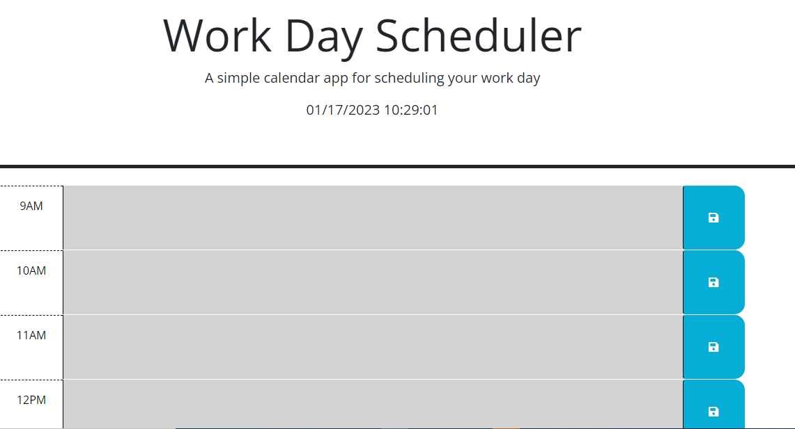

# daily-planner

# Description

In this project i reconfigured a stater code to create a simple calendar application that allows a user to save events for each hour of the day powered by jQuery.

https://safi1317.github.io/daily-planner/

# Screenshot

# installation

N/A

# usage

N/A

# credit

N/A

# licence

MIT licence
